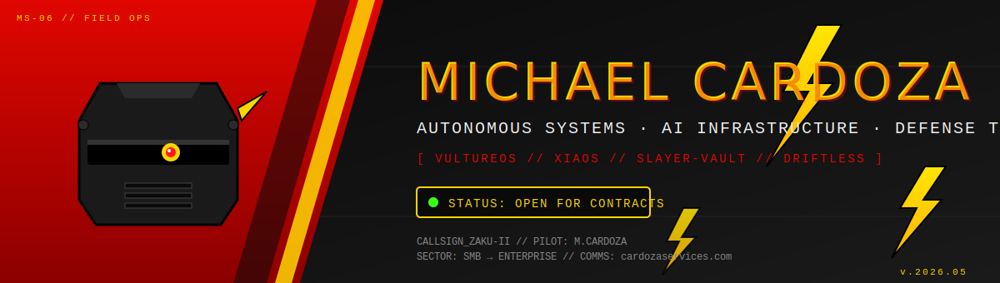

---

## ⚡ Operator Brief

I build **autonomous systems command centers**, **AI infrastructure**, and **defense-tech tooling** — fielding agents that act on the world without leaking secrets, drifting from spec, or going blind to threats. Mostly Go, mostly opinionated.

> *"I'm available. Small jobs, big jobs, anything in between — if it ships autonomously, I want to build it."*

---

## ⚡ Flagship Systems

### 🦅 VultureOS — *Autonomous Systems Command Center*
The central nervous system for fleets of autonomous agents and unmanned platforms. Mission planning, telemetry, kill-switches, audit. Designed for operators who can't afford an agent going off-script.

> **Use case:** orchestrating heterogeneous autonomous assets (software agents + physical platforms) under a single command surface.

### 🛰️ Xiaos — *Drone Detection Modules*
Drone-detection modules running on the Xiaos stack — perimeter awareness, signature classification, and alerting for environments where uncatalogued aerial traffic is a problem.

> **Use case:** counter-UAS at fixed sites, critical infrastructure, and forward operating areas.

### 🔐 [slayer-vault](https://github.com/cardoza1991/slayer-vault) — *Secretless Agent Access* · Go
Self-hosted AI credential isolation. Agents call third-party APIs **without ever seeing the raw secrets** — the vault brokers the call, scopes it, and logs it.

### 🔁 [Driftless](https://github.com/cardoza1991/Driftless) — *Contract Sync Engine* · Go / Shell
AI-powered sync engine that keeps your frontend and backend in lockstep. Catches schema/contract drift before it ships.

### 🤖 [droidz](https://github.com/cardoza1991/droidz) — *Agent Runtime Lab* · Go
Lightweight agent runtime experiments — the building blocks under the rest of the stack.

### 🎙️ [Sunshine Mic Pass-Through](https://github.com/cardoza1991/sunshine-mic-passthrough) — *OSS Contribution* · C++
Bidirectional mic support for the [Sunshine](https://github.com/LizardByte/Sunshine) streaming server. Cross-platform; long-standing community request — [upstream PR #4078](https://github.com/LizardByte/Sunshine/pull/4078).

---

## ⚡ Hire Me

I take contracts across the full range — **one-week spikes to multi-month builds.**

| Job size | What that looks like |
|---|---|
| 🟡 **Small** | Audit, agent-hardening review, credential-hygiene pass, single-feature ship |
| 🔴 **Medium** | Build an internal agent + the guardrails around it, MVP-to-production lift |
| ⚫ **Large** | Architect a command-and-control stack from scratch — fleet, telemetry, security |

**Specialties:** autonomous-agent orchestration · AI credential isolation · counter-UAS / drone detection · agent guardrails · Go backend infra · gov / defense-adjacent work.

### **→ [cardozaservices.com](https://cardozaservices.com) ←**

---

## ⚡ Field Stats

---

*⚡ MS-06 // FIELD OPS // ZAKU-II ⚡*

